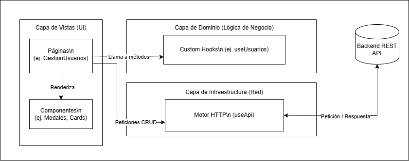

# JyPS Front Web - Panel de Administración


**JyPS Front Web** es una aplicación Frontend de página única (SPA) diseñada para la gestión y administración de recursos y usuarios. Construida con un enfoque estricto en **Clean Code, escalabilidad y Experiencia de Usuario (UX)**, utilizando las tecnologías más modernas del ecosistema web.

---

## 📖 Tabla de Contenidos
1. [Sobre el Proyecto](#-sobre-el-proyecto)
2. [Stack Tecnológico](#-stack-tecnológico)
3. [Arquitectura y Patrones de Diseño](#-arquitectura-y-patrones-de-diseño)
4. [Estructura del Proyecto](#-estructura-del-proyecto)
5. [Instalación y Despliegue](#-instalación-y-despliegue)
6. [Capturas de Pantalla](#-capturas-de-pantalla)
7. [Estructura del Proyecto](#-estructura-del-proyecto)
---

## 🎯 Sobre el Proyecto

El objetivo de este proyecto es proporcionar una interfaz administrativa robusta, rápida y responsiva. Actualmente cuenta con un **Módulo de Gestión de Usuarios** altamente dinámico, que permite realizar operaciones CRUD completas, filtrado inteligente en tiempo real y validaciones complejas de formularios.

**Características principales:**
* **Gestión de Estado Eficiente:** Uso de Hooks de React para manejar datos complejos sin sobrecargar el DOM.
* **Componentes Inteligentes y Tontos:** Reutilización del 100% de la interfaz visual para diferentes contextos (ej. un mismo modal sirve para Crear y Editar adaptando su comportamiento).
* **Filtros Multicriterio:** Búsqueda en tiempo real por texto, estado, departamento y roles.
* **Responsive Design:** Adaptabilidad total desde dispositivos móviles hasta pantallas de escritorio.

---

## 🛠️ Stack Tecnológico

El proyecto está construido con herramientas modernas para garantizar un rendimiento óptimo:

* **Core:** React 18 (Hooks, Functional Components).
* **Build Tool:** Vite (Para un HMR ultrarrápido y builds optimizados).
* **Estilos:** Tailwind CSS (Utility-first CSS para diseños a medida rápidos).
* **Iconografía:** Lucide React (Íconos SVG ligeros y consistentes).
* **Peticiones HTTP:** Fetch API nativa envuelta en Custom Hooks asíncronos.

---

## 🏗️ Arquitectura y Patrones de Diseño

Para garantizar que el código sea mantenible a largo plazo, el proyecto implementa una versión adaptada de **Clean Architecture** para Frontend:

### 1. Separación de Responsabilidades (Separation of Concerns)
Hemos dividido la lógica en 3 capas distintas:
* **Capa de Vista (`/pages` y `/components`):** Componentes puramente visuales. No saben de dónde vienen los datos, solo saben cómo dibujarlos.
* **Capa de Dominio (`/hooks/useUsuarios.js`):** Contiene la lógica de negocio y actúa como un **Mapper/Adaptador**. Transforma los datos crudos del backend en un formato limpio que la Vista necesita.
* **Capa de Infraestructura (`/hooks/useApi.js`):** Un motor HTTP agnóstico centralizado que maneja cabeceras, CORS, parseo de JSON y manejo de errores (try/catch globales).

### 2. Diagrama de Flujo Arquitectónico


## 📁 Estructura del Proyecto
#### El código fuente está organizado de forma semántica para facilitar la escalabilidad:
```text
└── 📦 src
    ├── 📂 assets          
    ├── 📂 components      
    ├── 📂 modals       
    │   └── 📜 Card.jsx, Button.jsx, etc.
    ├── 📂 hooks           
    │   ├── 📜 useApi.js    
    │   └── 📜 useUsuarios.js 
    ├── 📂 pages          
    │   └── 📂 administrador 
    │       ├── 📜 AdministradorLayout.jsx
    │       └── 📜 GestionUsuarios.jsx
    ├── 📜 App.jsx         
    ├── 📜 main.jsx        
    └── 📜 index.css   
```

---

## 🐳 Integración con Docker (API existente)

Se agregaron archivos para contenerizar este frontend y conectarlo al servicio de API `jyps-api` ya definido en tu `docker-compose`:

* `Dockerfile` (build multi-stage con Vite + Nginx)
* `nginx.conf` (servir SPA + proxy `/api/*` -> `jyps-api:8081`)
* `.dockerignore`
* `.env.example`

### 1) Servicio a agregar en el `docker-compose.yml` del backend

```yaml
services:
    jyps-api:
        # ... tu configuración actual

    jyps-front:
        build:
            context: ../JyPS-Front-Web
            dockerfile: Dockerfile
            args:
                VITE_API_BASE_URL: /api/v1
        container_name: jyps_frontend
        ports:
            - "5173:80"
        depends_on:
            - jyps-api
```

> Nota: `context: ../JyPS-Front-Web` asume que ambos repositorios (`JyPS-BackEnd` y `JyPS-Front-Web`) están al mismo nivel.

### 2) Levantar servicios

```bash
docker compose up --build -d
```

### 3) Probar

* Frontend: `http://localhost:5173`
* API (directa): `http://localhost:8081`
* API desde frontend (proxy): `http://localhost:5173/api/v1/...`

### 4) Desarrollo local con Vite

Para `npm run dev`, puedes usar:

```env
VITE_API_BASE_URL=/api/v1
VITE_API_PROXY_TARGET=http://localhost:8081
```

Con eso, Vite hace proxy local y evitas CORS durante desarrollo.